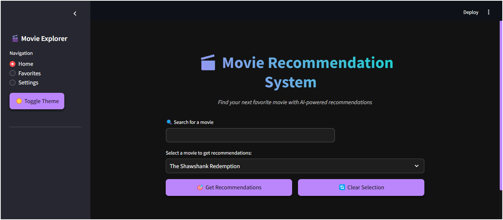
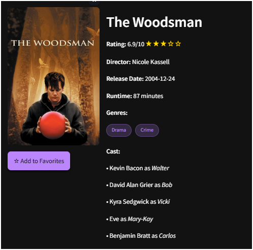
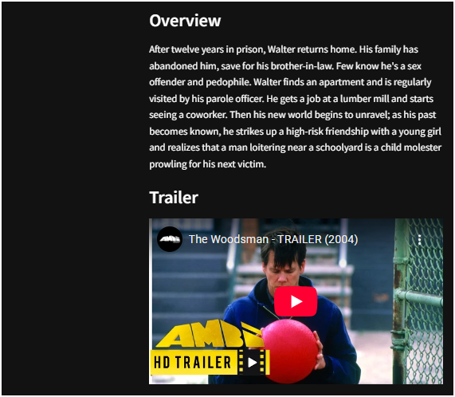
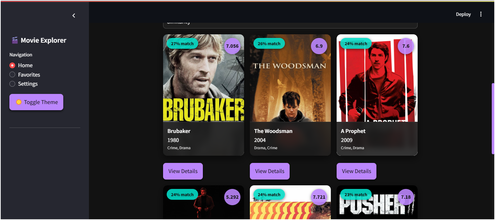
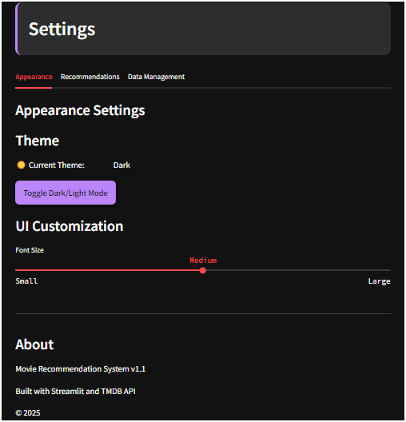
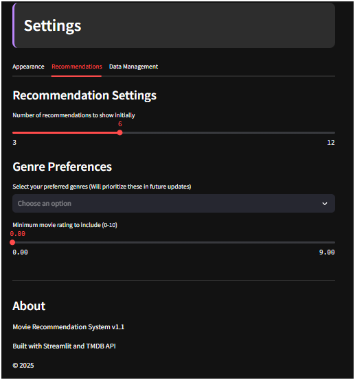
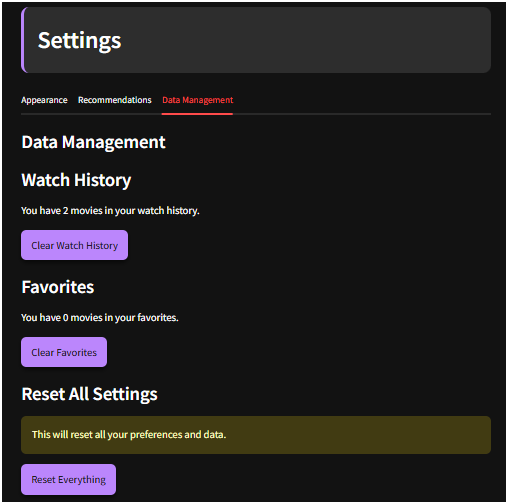

# 🎬 Movie Recommendation System


An AI-powered movie recommendation system with an elegant, theme-switchable UI that provides personalized movie suggestions based on collaborative filtering and content-based approaches.

## Screenshots

### Home Page



### Movie Details




### Recommendations



### Settings Page





## ✨ Features

- **AI-Powered Recommendations**: Get personalized movie suggestions based on similarity metrics
- **Theme Support**: Toggle between light and dark mode for comfortable viewing
- **Movie Details**: View comprehensive details including trailers, cast, ratings, and more
- **Favorites System**: Save your favorite movies for quick access
- **Watch History**: Automatically track your viewed movies
- **Custom Settings**: Personalize your recommendation experience
- **Search Functionality**: Easily find movies in the database
- **Sort Options**: Arrange recommendations by similarity, rating, release date, or popularity

## 🚀 Technologies Used

- **Python**: Core programming language
- **Streamlit**: Web application framework for the UI
- **TMDB API**: For fetching detailed movie information and posters
- **Scikit-learn**: For computing similarity matrices and recommendation algorithms
- **Pandas**: For data manipulation and analysis
- **Pickle**: For storing and loading trained models

## 📋 Prerequisites

- Python 3.10 or higher
- TMDB API Key

## 🔧 Installation

1. Clone the repository:

   ```
   git clone https://github.com/scorpionTaj/Movie-Recommandation-System.git
   cd Movie-Recommandation-System
   ```

2. Install required packages:

   ```
   pip install -r requirements.txt
   ```

3. Create a `.env` file in the project root with your TMDB API Key:

   ```
   TMDB_API_KEY=your_api_key_here
   ```

4. Ensure you have the data files (`movies.pkl` and `similarity.pkl`) in the project directory.

## 💻 Usage

1. Run the Streamlit app:

   ```
   streamlit run app.py
   ```

2. Open your browser and go to `http://localhost:8501`

3. Select a movie from the dropdown list and click "Get Recommendations"

4. Explore movie details, save favorites, and adjust settings as desired

## 🔑 Getting a TMDB API Key

1. Create an account on [The Movie Database](https://www.themoviedb.org/)
2. Go to Settings > API and request an API key
3. Follow the instructions to generate a key for development purposes

## 📁 Project Structure

```
movie-recommendation-system/
│
├── app.py                  # Main application file with UI and recommendation logic
├── movies.pkl              # Pickle file containing preprocessed movie data
├── similarity.pkl          # Similarity matrix for recommendation generation
├── .env                    # Environment variables (API keys)
├── requirements.txt        # Required Python packages
└── README.md               # Project documentation
```

## 🤔 How It Works

The recommendation system uses collaborative filtering and content-based filtering techniques:

1. **Data Preprocessing**: Movies are analyzed based on features like genres, keywords, cast, and crew
2. **Similarity Calculation**: Cosine similarity is used to compute how similar movies are to each other
3. **Recommendation Generation**: When you select a movie, the system finds other movies with the highest similarity scores

## 📊 Dataset

The system uses a dataset of movies that includes details such as:

- Movie titles, genres, and release dates
- Cast and crew information
- Plot descriptions and keywords
- User ratings and popularity metrics

## 🔮 Future Enhancements

- User accounts and authentication
- Machine learning model improvements
- Additional filters and recommendation criteria
- Social features (sharing recommendations, following other users)
- Mobile app version

## 👨‍💻 Contributing

Contributions are welcome! Please feel free to submit a Pull Request.

1. Fork the repository
2. Create your feature branch (`git checkout -b feature/amazing-feature`)
3. Commit your changes (`git commit -m 'Add some amazing feature'`)
4. Push to the branch (`git push origin feature/amazing-feature`)
5. Open a Pull Request

## 📄 License

This project is licensed under the MIT License - see the LICENSE file for details.

## 🙏 Acknowledgments

- Data provided by [The Movie Database (TMDB)](https://www.themoviedb.org/)
- Icons and visual elements from various open-source projects
- Streamlit team for their amazing framework

---

⭐ Star this repo if you find it useful! ⭐
